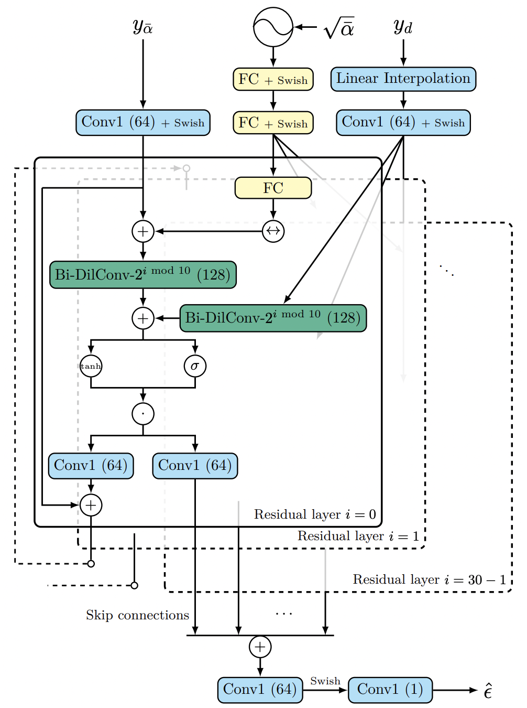
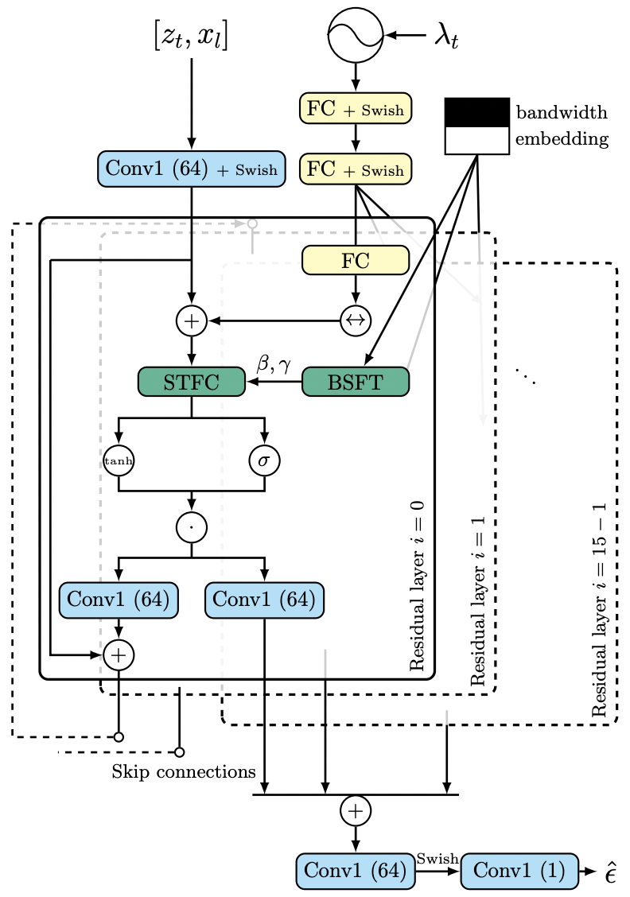
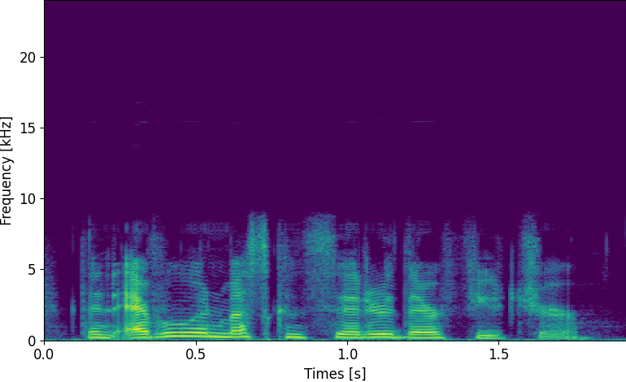
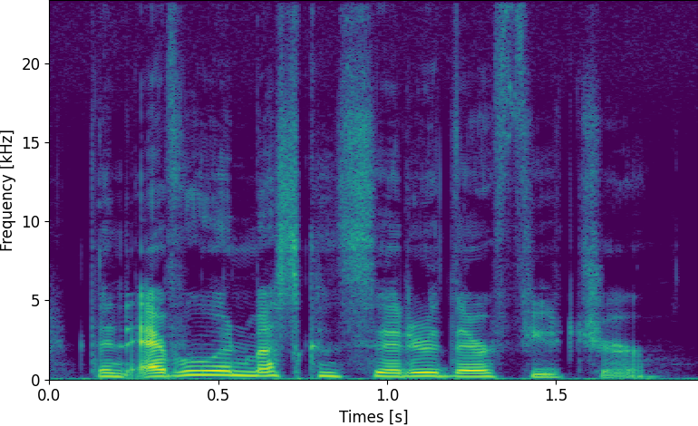
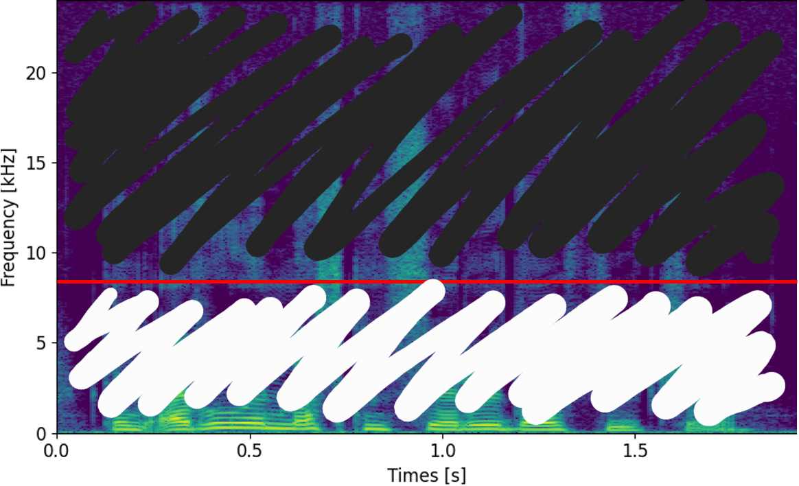

import clsx from 'clsx';
import styles from '../blog.module.css';

import figalgo from './image/algorithm.png';
import figspade from './image/spade.png';
import figstfc from './image/stfc.png';
import figsample from './image/sample.png';
import figsample_zoomed from './image/sample_zoomed.png';
import figmetrics from './image/mectrics.png';
import figabx from './image/abx.png';
import figSampling from './image/sampling.gif';

  

> Seungu Han and Junhyeok Lee. "NU-Wave 2: A General Neural Audio Upsampling Model for Various Sampling Rates" 
>
> INTERSPEECH 2022

## NU-Wave 2: A General Neural Audio Upsampling Model for Various Sampling Rates
안녕하세요. MINDs Lab Brain에서 Audio 연구를 하고 있는 한승우입니다. 작년에 소개해드렸던 ["NU-Wave: A Diffusion Probabilistic Model for Neural Audio Upsampling"](https://mindslab-ai.github.io/blog/nu-wave)[[1]](#r1)의 후속 연구인 NU-Wave 2를 소개하려합니다. 앞서 [현재](https://github.com/chohyunjae1)님이 소개해주신 ["SANE-TTS: Stable And Natural End-to-End Multilingual Text-to-Speech"](https://mindslab-ai.github.io/blog/sane-tts)와 함께 Interspeech 2022에 accept 되어 9월 18일부터 22일까지 인천 송도에서 열린 Interspeech 2022에서 구두 발표를 마치고 왔습니다. 코로나 19로 인해 처음으로 대면으로 참석한 국제학회이면서도 많은 사람들 앞에서 발표까지 하게 되어 긴장되면서도 설레었는데 다행히 무사히 발표를 마치고 왔습니다. 또한 다른 연구자분들의 발표도 듣고 질문도 하며 많은 국내외 연구자분들과 소통할 수 있는 소중한 경험이었습니다. 그럼 이제 연구를 같이 진행해주신 [준혁](https://github.com/junjun3518)님과 연구 및 발표에 도움을 주신 모든 MINDs Lab Brain 팀원분들께 감사 인사 전하며 NU-Wave 2 소개를 시작하겠습니다.

### Motivations
NU-Wave 2의 베이스가 되는 NU-Wave는 Diffusion Model을 적용해 최초로 오디오를 48 kHz로 upsampling 하는데 성공한 모델입니다. 더 자세한 내용은 [NU-Wave(Interspeech):](https://mindslab-ai.github.io/blog/nu-wave)를 참고해주세요. 하지만 NU-Wave는 몇 가지 문제를 지니고 있는데 첫번째 문제는 'ㅅ, ㅆ, ㅊ'와 같은 치찰음이나 마찰음은 고역대에서 잘 생성해내는 반면에 harmonic 성분은 잘 만들어내지 못한다는 점입니다. 또한 몇몇 논문들에서 NU-Wave가 다른 다양한 음역대를 생성하는데에는 성능이 좋지 않다는 결과를 보여줬습니다. 그리고 두번째 문제는 NU-Wave만의 문제는 아니지만 이전 오디오 Upsampling 모델들은 input과 output의 sampling rate가 고정되어있다는 점입니다. 이렇게 input, output sampling rate 쌍을 고정해버리면 새로운 쌍에 대해서 upsampling을 하고 싶을 때는 매번 모델을 새로 학습시켜야한다는 문제가 있습니다. 이를 해결하기 위해서 저희는 어떠한 sampling rate의 input이 들어와도 원하는 하나의 sampling rate의 오디오로 upsampling해주는 문제를 의논하고 이를 'General Neural Audio Upsampling'이라고 불렀습니다. 이 문제를 해결하게 되면 만약 원하는 결과의 sampling rate가 48 kHz라면 모델을 한 번만 학습시켜도 8 kHz든 12 kHz든 혹은 16 kHz든 어떤 sampling rate의 오디오도 48 kHz로 upsampling할 수 있게 되는겁니다. 

<!--truncate-->

이렇게 두 가지 문제를 해결하려한 연구가 NU-Wave 2이며 각 문제를 해결하기 위해서 차례대로 Short-Time Fourier Convolution (STFC)과 Bandwidth Spectral Feature Transform (BSFT)를 적용했습니다. 이 두가지 모듈에 대해서는 뒤에서 자세히 다루겠습니다.

### Architecture
원래는 모델 구조에 대해서 설명하기 전에 NU-Wave 2에서 적용한 diffuion process에 대해 설명해드려야하지만 다 설명해드리려면 글이 너무 길어질 것 같아 논문을 직접 참고해주시면 감사하겠습니다. 이를 정리한 알고리즘은 아래 그림과 같습니다. Diffusion model에 대한 간단한 설명은 [NU-Wave(Interspeech):](https://mindslab-ai.github.io/blog/nu-wave)에 잘 정리해주셨으니 같이 참고해주세요!

NU-Wave 2의 전체적인 모델 구조는 NU-Wave와 동일합니다. 다만 크게 다른 점은 Short-Time Fourier Convolution (STFC)와 Bandwidth Spectral Feature Transform (BSFT)를 적용시켰다는 점입니다. 이 두가지 모듈, STFC와 BSFT에 대해 차례대로 설명해드리겠습니다.

| NU-Wave Architecture       | NU-Wave 2 Architecture       |
| -------------------------- | -------------------------- |
| 

 | 

 |

#### Short-Time Fourier Convolution (STFC)
STFC는 Fast Fourier Convolution (FFC)[[1]](#r2)를 약간 수정한 모듈입니다. FFC는 vision 분야에서 제안된 구조로 local branch와 global branch로 이루어져 있습니다. local branch는 일반적으로 사용되는 convolution과 동일하고 global branch는 frequency domain에서의 convolution이 됩니다. 여기서 어떻게 frquency domain에서 convolution을 해주냐면 바로 Fast Fourier Transform (FFT)을 통해 feature를 frequency domain에서의 feature로 바꿔주고 1 \times 1 convolution 연산을 해줍니다. Convolution theorem에 따르면 이 연산은 변환되기 전의 feature에 global하게 convolution을 해준 것과 같게 됩니다. 그렇기 때문에 global branch라고 부르는 것이고 덕분에 넓은 receptive field를 가질 수 있었습니다. 뿐만 아니라 FFC를 사용한 inpainting model인 LAMA[[1]](#r3)에서는 FFC가 주기적인 구조를 생성해내는 데에 잘 맞는다고 얘기했습니다. 이런 장점들을 활용하기 위해 저희는 이 FFC를 저희 모델에 적용시키려했는데 한 가지 문제가 있었습니다. ***기존 FFC에서 feature를 frequency domain으로 보내주기 위해서 사용한 FFT는 image와 같이 고정된 길이의 데이터들에 대해서는 문제가 없었지만 길이가 다양한 audio에 대해서는 적용시킬 수 없다는 점입니다. 그래서 저희는 FFT 대신에 Short-time Fourier Transform (STFT)를 사용했고 이를 Short-Time Fourier Convolution (STFC)라고 명명했습니다. (수정 필요)*** 결론적으로 FFC의 장점은 가져오되 audio 데이터에 맞춰 수정하여 STFC에게 NU-Wave의 문제였던 harmonic 성분을 더 잘 만들어주는 동시에 receptive field도 넓혀주는 효과를 기대했습니다.

#### Bandwidth Spectral Feature Transform (BSFT)
그 다음으로는 BSFT에 대해 설명해드리겠습니다. BSFT는 vision domain에서의 feature normalization에 대한 연구들에서 영감을 얻었은 모듈입니다. SPADE[[1]](#r4)]라는 논문은 주어진 input semantic layout에 맞는 이미지를 생성해내는 연구입니다. 아래 그림을 보시면 어떤 연구인지 쉽게 이해하실 수 있을 것 같습니다.

그리고 이제 이걸 저희 연구에 대입해 생각해보면 아래와 같이 spectrogram에서, 즉 frequency domain에서 어느 부분이 input으로 들어온 부분인지, 그리고 어느 부분이 새로 생성해내야하는 부분인지를 알려주는 것이라고 생각할 수 있을 겁니다. 아래는 16 kHz의 input이 들어오는 경우이고 input의 sampling rate에 따라 달라지게 되겠지요. 저희는 이걸 bandwidth embedding이라고 일컫고 추가로 input으로 넣어주었습니다.

| Input                       | Output                      | Bandwidth Embedding      |
| --------------------------- | --------------------------- | --------------------------- |
| 

 | 

 | 

  |

이런 맥락에서 vision domain에서의 feature normalization에 사용된 아이디어를 가져와 적용한 연산은 간단합니다. $h$를 STFC 안에서 frequency domain으로 바뀐 feature, $\gamma$와 $\beta$를 bandwidth embedding으로부터 구해진 scaling, shifting parameters라고 했을 때 BSFT에서의 연산은 
$$
$\gamma \odot h + \beta$
$$
가 되고 이걸 layer 마다 모든 STFC에 같이 적용해주게 됩니다. 이를 통해서 저희는 input의 다양한 sampling rate를 conditioning 해줄 수 있었으며 더 나아가 input으로 들어와 그대로 보존되어야할 저역대 부분도 잘 보존할 수 있었습니다.

### Results
우선 저희는 학습시에 input은 6000~48000 Hz에 해당하는 랜덤 sampling rate의 audio, output은 48000 Hz의 audio에 대해 학습했습니다. 그리고 NU-Wave, WSRGlow[[1]](#r5)]를 똑같은 셋팅해서 학습하여 baseline으로서 비교해보았습니다. 수치적인 결과에 대해서 들어가기에 앞서 몇 개의 샘플을 통해 NU-Wave 2의 장점을 이야기해보려합니다.

우선 이건 16 kHz의 input에 대한 각 baseline 모델들의 output입니다. NU-Wave는 고역대를 생성해내지 못하는 반면에 WSRGlow와 NU-Wave 2는 고역대를 잘 만들어내는 것을 보실 수 있습니다.

harmonic 생성에 관련된 얘기를 하기 위해 2~6 kHz에 해당하는 spectrogram을 확대해서 살펴본 샘플입니다. 보시면 NU-Wave나 WSRGlow의 경우 harmonic에 해당하는 무늬가 대칭적으로 생기는 것을 볼 수 있습니다. 이는 spectral alias에 해당하는 현상이라고 볼 수 있지만 자세한 내용은 넘어가도록 하겠습니다. 다만 비교해서 보시면 NU-Wave 2의 경우에는 이 무늬가 자연스럽게 연결되어 생성되는 것을 보실 수 있을겁니다. 이 부분에 대해서도 수치적으로 측정하여 비교가 가능하다면 좋겠지만 이를 측정해줄 metric이 없는 관계로 이 정도 샘플들을 보여주고 넘어갔습니다. 더 많은 샘플들은 **[Github sample page](https://mindslab-ai.github.io/nuwave2/)**에서 확인하실 수 있습니다.

이제 마지막으로 수치적으로 metric을 비교해보도록 하겠습니다. 우선 이전 모델인 NU-Wave와 비교해보면 NU-Wave 2가 모든 경우에서 NU-Wave보다 좋은 성능을 내는 것을 보실 수 있습니다. 한편, WSRGlow와는 metric에 따라 성능 차가 좀 있는데요. NU-Wave 2가 LSD와 LSD-HF에 대해서는 WSRGlow보다 약간은 안좋지만 거의 비슷한 성능을 보이는 반면에 SNR과 LSD-LF에 대해서는 좋은 성능을 보이는 것을 확인할 수 있습니다. 이는 NU-Wave 2가 WSRGlow와 비슷하게 고역대를 생성해내는 능력을 가지고 있고 동시에 그대로 보존해야하는 input에 해당하는 저역대도 잘 보존해낸다고 해석이 가능합니다. 한편 WSRGlow는 270M에 육박하는 파라미터 수를 가지고 있지만 NU-Wave 2는 1.7M의 매우 적은 수의 파라미터 수를 가집니다.

정리하자면 NU-Wave 2는 이전 모델인 NU-Wave보다 좋은 성능을 내며 적은 파라미터로도 저역대는 잘 보존해주면서 WSRGlow만큼 고역대를 잘 생성해낼 수 있는 모델입니다.

이 외에 ABX test 결과도 측정했지만 딱히 유의미한 결과를 얻지는 못해 넘어가도록 하겠습니다. ***(그냥 테스트 결과까지 같이 없앨까??)***

*NU-Wave 2가 8번 만에 sampling하는 과정*

### Discussion
정리하자면 NU-Wave 2에서는 STFC를 써서 NU-Wave가 잘 생성해내지 못하던 harmonic을 생성해낼 수 있게 했으며 BSFT를 통해 general neural audio upsampling 문제를 해결해주었습니다. 연구에서는 8 kHz, 12 kHz, 16 kHz 등 주로 많이 사용되는 sampling rate에 대해서만 결과를 확인했지만 그 외에도 22.05 kHz나 임의의 sampling rate에 대해서도 upsampling을 해줄 수 있다는 장점도 가지고 있습니다. 아직은 성능이 완벽하지는 않지만 어떠한 오디오가 들어오든 고음질의 오디오를 얻어낼 수 있는 모델을 꿈꾸며 연구를 진행했습니다. 그럼 여기서 소개를 마치도록 하겠습니다. 긴 글 읽어주셔서 감사합니다!

### References

1. Lee, Junhyeok, and Seungu Han. "Nu-wave: A diffusion probabilistic model for neural audio upsampling." in *Interspeech*, 2021, pp. 1634-1638. [[arxiv]](https://arxiv.org/abs/2104.02321)

2. Chi, Lu, Borui Jiang, and Yadong Mu. "Fast fourier convolution." in *Advances in Neural Information Processing Systems*, 2020, pp. 4479-4488.

3. Suvorov, Roman, et al. "Resolution-robust large mask inpainting with fourier convolutions." in *Proceedings of the IEEE/CVF Winter Conference on Applications of Computer Vision*, 2022. [[arxiv]](https://arxiv.org/abs/2109.07161)

4. Park, Taesung, et al. "Semantic image synthesis with spatially-adaptive normalization." in *Proceedings of the IEEE/CVF conference on computer vision and pattern recognition*, 2019. [[arxiv]](https://arxiv.org/abs/1903.07291)

5. Zhang, Kexun, et al. "WSRGlow: A Glow-based waveform generative model for audio super-resolution." in *Interspeech*, 2021, 1649-1653 [[arxiv]](https://arxiv.org/abs/2106.08507)
